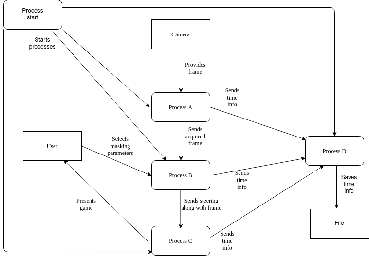
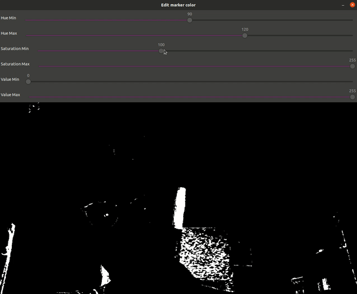

# Multiprocess Snake Game Project
## Authors: Bartosz Świrta, Radosław Radziukiewicz
### Dependencies: CMake, OpenCV, POSIX

# Project Overview

This project was created as the part of real-time systems
course (SCZR) realised on Warsaw University of Technology.
Project implements custom snake game, which is performed 
by 5 processes. It was necessary to implement 
proper synchronization between those processes. Our system implements
two methods of synchronization.

---

# How to run the project

After downloading and extracting this repository, one should
create directory for cmake initialization. After creating such 
directory (ex. build) one should type:  
`cd build`  
`cmake ..`  
These commands will initialize project structure. After that one 
has to compile all processes. To do so, one has to type all these commands:  
`make capture`  
`make info`  
`make start`  
`make process`  
`make game`  
To start the system, one has to start process name 'start' (present in bin directory)
with argument 0 or 1 (represents synchronization type).

---

# Game description

System implements custom snake game. Player controls head of the snake
via special marker. Such marker can be anything (pen, notebook or cat).
The only requirement is that marker is uni-colour (enables easy detection on the frame).   
Process responsible for image processing will look for the marker on the frame
After spotting it, it will send marked point as the current position for 
snake's head. When the system starts, one is capable of setting marking
object with live preview of the result of marking.  
Player's target is to gain as high score as he can. Score increases
after consuming fruit, which appears on the screen.

---

# Processes Overview

As mentioned above, system consists of 5 separate processes:
>Process A (frame capturing) - loads frame from camera connected to the computer and sends it to process B.  
>Process B (image processing) - process finds marker position and sends it to process C along with frame.  
>Process C (game logic) - process responsible for controlling game and displaying it.  
>Process D (info gathering) - process collects information about overall system speed.  
>Process E (starting the system) - allocates necessary resources and monitors system functioning.  

---

# Diagram of the system

Below system architecture diagram is being presented:

---

# Processes synchronization

System implements synchronization via shared memory blocks.
Access to these blocks is synchronized with semaphores (synchronization
mode 0) or with queues (synchronization mode 1). In order to allocate 
and manage proper resources, operaing system should support POSIX style
queues, semaphores and shared memory allocation.

---

# System in action

Below we present some visual data showing lunched system:  

**Marker adjustment**  

**Brilliant gameplay**  

